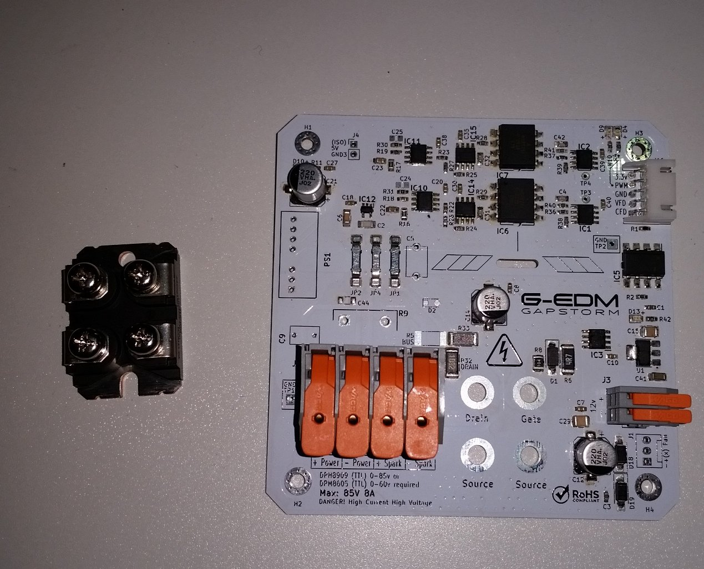
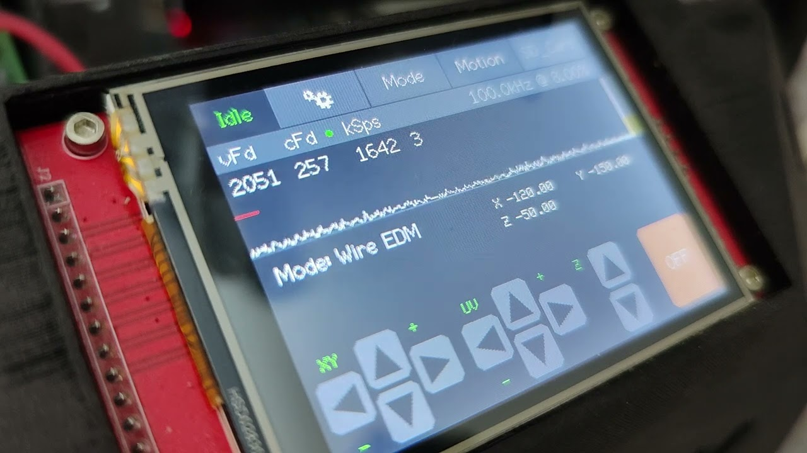

</br>
</br>
</br>

```diff
 ______     _______ ______  _______
|  ____ ___ |______ |     \ |  |  |
|_____|     |______ |_____/ |  |  |
___  _  _ ____ __ _ ___ ____ _  _
|--' |--| |--| | \|  |  [__] |\/|

v3.0.0

This is a beta version for testing purposes.
Only for personal use. Commercial use or redistribution without permission is prohibited. 
Copyright (c) Roland Lautensack   
```                                                               

</br>
</br>

# Wiki (Work in progress)

[A little Wiki can be found here](https://gedm.org/wiki)

</br>
</br>


# Pre-alpha release (Please be patient)

* Still not fully tested but I decided to provide a firmware for the new PCBs. There is so much to do and I haven't found much time yet to fully explore the new boards and make the firmware match them. This release is just the initial one and should be considered as a start.

* The next weeks will be spend on deep testing and process optimisations. This repo will get many upgrades in this time.

* No warranty. G-EDM is a nice little Hobby project for people that have fun watching sparks and working on projects.
It doesn't claim industrial level quality. While the project is evolving fast there may be developement cycles where the firmware is unusable or some specific features are bricked. it is impossible to keep track of everything and it can happen that a firmware update renders a feature unusable. In this case please contact the support hotline. :D
If such a situation occurs it normally is easy to fix. Sometimes just a wrong variable type can result in dramatic failures.

</br>
</br>

# Bugs

* There is still an issue sometimes while changing paramaters. I wasn't able to get behind it yet and thought it was gone after some changes. But out of a sudden it came back. 
Last time I run some tests with sinker and pressed the settings button in the process screen to change some paramaters the ESP rebooted. It did not happen if I first used the pause button and then opened the settings.
Will debug this soon and provide a fix. Pretty sure it is nothing big and should be fixed fast.

</br>
</br>


# About this firmware

* This firmware is written for the G-EDM Gapstorm PCB. It will not run with the previous EVOIII PCBs.
    It is possible to upgrade the EVOIII PCB to make them match the specs of the gapstorm board.
    A detailed walkthrough on how to upgrade the EVOIII board will follow soon. It is not hard and requires just a few minor changes.
    Some images can be found on the gedm.org website. Just click the image below.
    
</br>

[](https://gedm.org/photos/1/album/a655d21b876f5ba21783beb6c846ac8f)

</br>
</br>


# Updates coming soon

* Toolpathvisualization
* Sinker mode review
* Re-implementation of the floating Z engraving mode

</br>
</br>


# Youtube demo

[](https://www.youtube.com/watch?v=4ZwsoZURtmQ)

</br>
</br>

# PhantomEDM

* Firmware for wire and sinker EDM machines build with the G-EDM EVO electronics.

* It supports router type CNC machines with three axis plus a spindle stepper. Rotary axis support is planned for the future.

* For 2D wire EDM a z axis is not needed. 

</br>
</br>

# Install

* Download the repo and extract the folder. Load the folder into visual studio code.
Make sure the platform.io extension is installed in vstudio. After the folder is loaded it will prepare everything.
This can take some time. Once finished restart vcode. If you already have a running G-EDM firmware on the ESP you can
update it by placing the compiled binary on the SD card and just insert it. The initial version will require a restart of the ESP
to start the update. Once the Phantom release is installed a restart is not required anymore for update over SD. 

* To use update via SD card press the compile button. The firmware.bin file should be located in the project folder at /.pio/build/esp32dev/firmware.bin Just copy the firmware.bin file into the top root directory of the SD card.

* If this is the initial install on a fresh ESP without any G-EDM firmware it needs to be flashed from vcode. Just press the upload button while the board is connected via USB. On windows it may be needed to install the USB to UART drivers first: https://www.silabs.com/developer-tools/usb-to-uart-bridge-vcp-drivers

</br>
</br>

# Install on ESP32 that has the old firmware installed (pre phantom)

* It seems there could be an issue if this version is updated on an ESP containing the "old/stable" firmware. If there is the stable firmware present it is currently recommended to use a fresh ESP for this version or hard reset the board. The issue may be related to a different esp-idf version used in the new code.

* It seems to work if the ESP with the old version gets a real factory reset with esptool:

* To fully reset your ESP32, you can use a tool called esptool to erase the flash memory. Connect your ESP32 to your computer, install Python and esptool, then run the command python -m esptool --chip esp32 erase_flash in your terminal while holding the BOOT button on the device.

</br>
</br>

# Factory reset after initial install and on updates is recommended

* After the machine receives an update it is good to factory reset everything. Insert an SD card and open the SD menu. Press the last tab and touch the factory reset button. This deletes the NVS key value store used to store the settings from the last session.

</br>
</br>

# Hidden features

* If the screen is touched on bootup it will enforce a display recalibration. Once the display turns black it can be untouched and the calibration will start
</br>
</br>
* If for some reason the display blanks out in the process it is possible to re-init the display by touching any point on the display that is not a touch element. In the process only two elements are touchable. Settings button and pause button. Touching the area above those buttons will re-init the display (don't know if it works in the case of a bricked screen) Works only if the settingsmenu is not open.

</br>
</br>


# Donations

    Become a supporter now and help accelerate development with a donation. Circuit boards, electronic components, hardware and software development are just some of the costs that need to be covered. Without the support of the community, this wouldn't be possible.
    Every supporter receives an entry with their name or alias in the credit list displayed on the firmware boot screen.
    Click the image to support the project with a little paypal donation.


[](https://www.paypal.com/donate/?hosted_button_id=QP5LHGRUCXXBL)


</br>
</br>


# Legal notes

    The author of this project is in no way responsible for whatever people do with it.
    No warranty. 

</br>   
</br>


# Credits to whom credits belong

    Thanks for the support and help to keep the project going.

    @ Tanatara
    @ 8kate
    @ Ethan Hall
    @ Esteban Algar
    @ 666
    @ td1640
    @ Nikolay
    @ MaIzOr
    @ DANIEL COLOMBIA
    @ charlatanshost
    @ tommygun
    @ renyklever
    @ Zenitheus
    @ gerritv
    @ cnc
    @ Shrawan Khatri
    @ Alex Treseder
    @ VB
    @ AndrewS
    @ TK421
    @ sarnold04

</br>   
</br>


# Responsible for the content provided

    Lautensack Roland (Germany)


</br>   
</br>


# License

    All files provided are for private use only if not declared otherwise and any form of commercial use or redistribution of the protected files is prohibited. 
